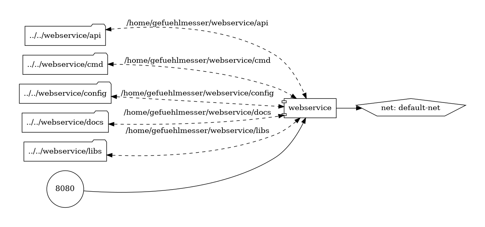

# 1. Gefuehlmesser - Medidor de Sentimentos


Plataforma de software construída para realizar análises de sentimentos, em tempo real, processando mensagens de feeds para calcular métricas de engajamento usando algorítmos determinísticos.
Avaliação técnica para a posição de desenvolvedor de software na [MBRAS Empreeendimentos](https://github.com/MBRAS-Emprendimentos).

## 1.1. TOC

- [1. Gefuehlmesser - Medidor de Sentimentos](#1-gefuehlmesser---medidor-de-sentimentos)
  - [1.1. TOC](#11-toc)
  - [1.2. Preliminares](#12-preliminares)
  - [1.3. Topologia do projeto (WiP)](#13-topologia-do-projeto-wip)
  - [1.4. Manipulação do projeto](#14-manipulação-do-projeto)
    - [1.4.1. Startup](#141-startup)
    - [1.4.2. Shutdown](#142-shutdown)
  - [1.5. TL;DR](#15-tldr)
  - [1.6. O que deseja fazer?](#16-o-que-deseja-fazer)


## 1.2. Preliminares

Esse projeto foi desenvolvido utilizando as seguintes ferramentas:

- [Go (`go`)](https://tip.golang.org/doc/go1.25): v1.25.1 ou superior
- [Docker Engine](https://docs.docker.com/engine/install/ubuntu/): v28.0.1 ou superior:
    - [Comando `docker` sem ser `sudo`](https://docs.docker.com/engine/install/linux-postinstall/). Opcional;
- [Docker Compose](https://docs.docker.com/compose/install/linux/): v2.29.7-desktop.1 ou superior;
- [GNU Make](https://www.gnu.org/software/make/): v4.3 ou superior.


## 1.3. Topologia do projeto (WiP)


Em linhas gerais, o projeto é composto de:

- `webservice`: Um servidor de aplicação HTTP, implementado em Go, utilizando uma estrutura idiomática baseada em um padrào de projeto orientado à recursos de API (_resource-oriented design_). No tocante a essa camada, a aplicação serve um API RESTful com os seguintes recursos:
  - API utilitária (`/utilitary`):
    - Requisições de _healthchecking_, de modo a verificar a sanidade do servidor de aplicação;
  - API de analise de sentimentos (`/api/v1/sentiment`):
    - Requisições para determinar a análise de sentimento para:
      - Um feed com um conjunto de mensagens;
      - Uma única mensagem; 
- `infra`: Contem as declarações do [manifesto](./infra/docker/compose.yml) do Docker Compose da [imagem](./infra/docker/webservice/Dockerfile) Docker do serviço `webservice`, além de arquivos subsidiários ao funcionamento do servidor
- `Makefile`: Comandos executados via `make`, implementados para facilitar a manipulação da camada de automação do projeto;
- `scripts`: Scripts que são consumidos pelos comandos executados via `make`
- `.github` Uma camada de infraestrutura como código (IaC). Na pasta `workflows`, foram implementadas duas pipelines, executadas automaticamente pelo Github Actions:
  - `static-analysis.yml`: Realiza a execução de testes unitários, verificação de vulnerabilidades e linting do código-fonte
  - `image-analysis.yml`: Realiza a análise de sanidade da imagem Docker do serviço `webservice`, de modo a garantir o uso eficiente dos recursos do contêiner, em tempo de execução.





## 1.4. Manipulação do projeto

Através do `make`, via scripts de automação do Docker Compose implementados em um [Makefile](./Makefile), na raíz do projeto. Para conferir a documentação de cada script, basta executar no terminal

```bash
make                                # Sem nenhum comando, executa o fallback 'help'
make help                           # Explicitamente, mostra a documentação
```

### 1.4.1. Startup

Considerando uma instalação inicial, na raíz do projeto, execute os seguintes comandos:

```bash
$ make swagger                   # Gera ou atualiza a pasta `./webservice/docs`, a qual contém 
$ make build c=webservice        # Realiza a build da imagem Docker, cujo manifesto encontra em `./infra/docker/webservice`
$ make init c=webservice         # Inicia o container do serviço `webservice`, em modo detached, e inicia a captura de logs
```

> [!NOTE]
> Para se certificar de que as imagens foram geradas pelo processo de build, basta executar o comando `docker image ls`.
> 
> Para se certificar de que os contêineres foram de fato devidamente iniciados e na escuta das portas corretas, basta executar o comando `make ps`.
> 
> Para ver os logs de um conteiner específico, execute `make logs c=[nome-do-serviço]`.


> [!IMPORTANT]
> A documentação da API RESTful pode ser acessada pela Swagger UI, via browser, através da URL [`http://localhost:8080/api/v1/swagger`](http://localhost:8080/api/v1/swagger/index.html#/)
> 
> De modo a conduzir testes exploratórios na API RESTful, foram criados uma _collection_ e um _environment_ do Postman. Ambos se encontram em [`./resources/testing`](./resources/testing/)
>
> 


### 1.4.2. Shutdown

Similarmente, para ambos os ambientes, de modo a encerrar a execução de todos os contêineres, basta rodar:

```bash
make stop          # Interrompe os contêineres que estiverem sendo executados
make clean         # Opcional. Remove os contêineres e a network associadas aos serviços do ambiente
```

## 1.5. TL;DR

Entre em contato com o desenvolvedor do projeto:

- Guilherme Lima Gonçalves
  - [Github](https://github.com/lwglg) 
  - [E-mail](mailto:lwglguilherme@gmail.com)

---

## 1.6. O que deseja fazer?

- [Voltar ao topo](#11-toc)
